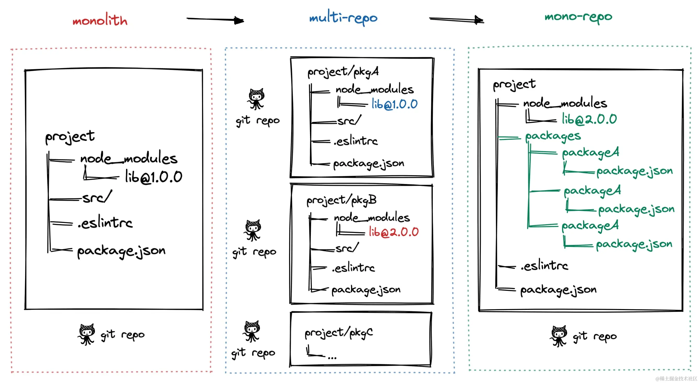
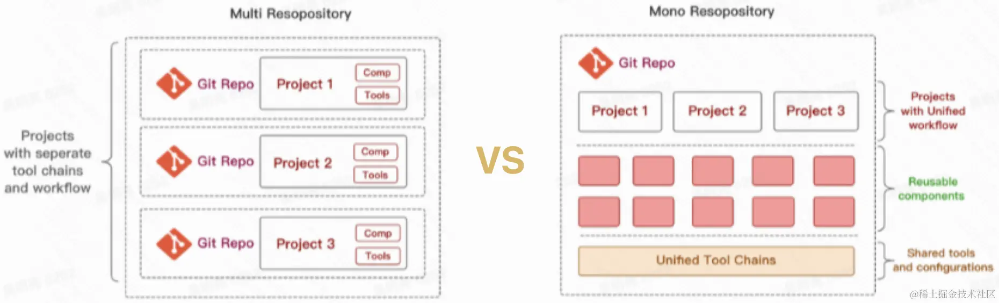
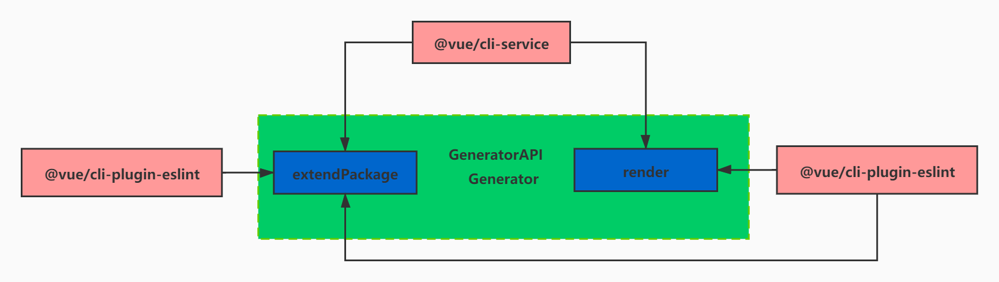
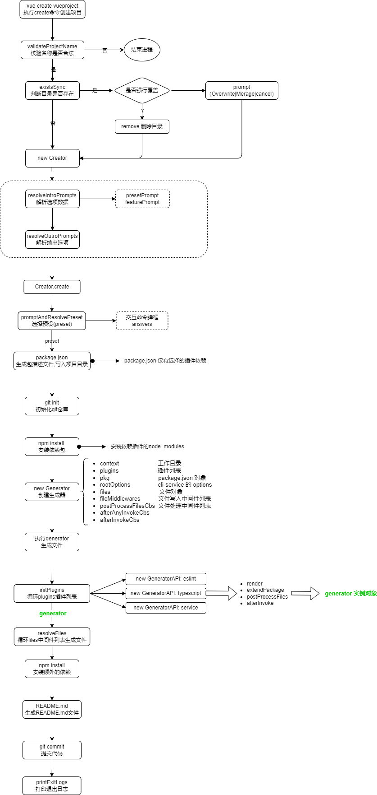

### 准备工作

#### 1. Monorepo

> Monorepo 是一种项目代码管理方式，指单个仓库中管理多个项目，有助于简化代码共享、版本控制、构建和部署等方面的复杂性，并提供更好的可重用性和协作性。

**1.1 Monorepo 演进分为三个阶段**



**1.2 Monorepo 优劣**



#### 2. Lerna

> Lerna 是一个 npm 包工具，特别是针对使用 Monorepo（单一版本库）模式的项目。它可以帮助开发团队在一个版本库中管理多个包（packages），简化了多包项目的开发、测试、发布和依赖管理等流程

**lerna 常用命令**
| 命令 | 功能 |
| :------ | :------ |
| lerna bootstrap | 安装依赖 |
| lerna clean | 删除各个包下的 node_modules |
| lerna init | 创建新的 lerna 库 |
| lerna list | 查看本地包列表 |
| lerna changed | 显示自上次 release tag 以来有修改的包， 选项同 list |
| lerna diff | 显示自上次 release tag 以来有修改的包的差异 |
| lerna exec | 在每个包目录下执行任意命令 |
| lerna run | 执行每个包 package.json 中的脚本命令 |
| lerna add | 添加一个包的版本为各个包的依赖 |
| lerna import | 引入 package |
| lerna link | 链接互相引用的库 |
| lerna create | 新建 package |
| lerna publish | 发布 |

#### 3. yarn workspace

- yarn workspace 允许我们使用 monorepo 的形式来管理项目
- 在安装 node_modules 的时候它不会安装到每个子项目的 node_modules 里面，而是直接安装到根目录下面，这样每个子项目都可以读取到根目录的 node_modules
- 整个项目只有根目录下面会有一份 yarn.lock 文件。子项目也会被 link 到 node_modules 里面，这样就允许我们就可以直接用 import 导入对应的项目
- yarn.lock 文件是自动生成的,也完全 Yarn 来处理.yarn.lock 锁定你安装的每个依赖项的版本，这可以确保你不会意外获得不良依赖

#### 4. 使用到的 npm 工具包

1. `commander.js` commander 是一款强大的命令行框架，提供了用户命令行输入和参数解析功能
2. `inquirer.js` 是一个用来实现命令行交互式界面的工具集合。它帮助我们实现与用户的交互式交流
3. `execa` execa 是可以调用 shell 和本地外部程序，会启动子进程执行，是对 child_process.exec 的封装
4. `chalk ` chalk 可以修改控制台字符串的样式，包括字体样式、颜色以及背景颜色等
5. `ejs` ejs 是高效的嵌入式 JavaScript 模板引擎

   - <% '脚本'标签，用于流程控制无输出
   - <%\_ 删除其前面的空格符
   - <%= 输出数据到模板 (输出是转义 HTML 标签)
   - <%- 输出非转义的数据到模板
   - <%# 注释标签，不执行，不输出内同
   - 输出字符串
   - %> 一般结束标签
   - -%> 删除紧随其后的换行符
   - \_%> 将结束标签后面的空格符删除

6. `slash` 将 Windows 反斜杠路径转换为斜杠路径，如 `foo\\bar` ➔ `foo/bar`
7. `globby` 是用于模式匹配目录文件的
8. `isbinaryfile` 可以检测一个文件是否是二进制文件
9. `ora` 主要用来实现 node.js 命令行环境的 loading 效果，和显示各种状态的图标等
10. `import-local` 当我们本地 node_modules 存在一个脚手架命令，同时全局 node_modules 中也存在这个脚手架命令的时候，优先选用本地 node_modules 中的版本
    通常来讲，全局安装一个脚手架后，本地是不需要安装脚手架的。但是当我们本地安装脚手架的时候，意味着我们项目里用到了这个脚手架。当与全局冲突的时候，比如全局和本地都有这个脚手架，但是版本不同，那么我们应该使用本地的脚手架。这就是 import-local 的作用。
11. `semver` Semver 是一个专门分析 Semantic Version（语义化版本）的工具，“semver”其实就是这两个单词的缩写。Npm 使用了该工具来处理版本相关的工作。

    - 比较两个版本号的大小
    - 验证某个版本号是否合法
    - 提取版本号，例如从“=v1.2.1”体取出"1.2.1"
    - 分析版本号是否属于某个范围或符合一系列条件

12. `colors` colors.js 是 Nodejs 终端着色 colors 插件
13. `root-check` 尝试降级具有 root 权限的进程的权限，如果失败则阻止访问
14. `user-home` Get the path to the user home directory
15. `path-exists` 判断路径是否存在，支持同步和异步
16. `minimist` minimist 是 nodejs 的命令行参数解析工具，是用于处理命令行调用 node 指令时，处理 node 之后的一系列参数的模块 使用文档 [minimist](http://isqing.cn/node/packages/minimist.html)
17. `dotenv` Dotenv 是一个零依赖的模块，它能将环境变量中的变量从 .env 文件加载到 process.env 中。使用文档 [dotenv](https://www.npmjs.com/package/dotenv)
18. `url-join` url-join 可以快速的帮我们拼接出常见格式的 url 地址。
19. `pkg-dir` 在指定文件路径中寻找带有 package.json 文件的目录是否存在
20. `npminstall`
21. `child_process` node 内置模块，子进程
22. `cli-spinner` A simple spinner for node cli.

### @vue/cli 核心概念

[@vue/cli](https://cli.vuejs.org/zh/guide/) 是一个基于 Vue.js 进行快速开发的完整系统

#### 插件

- Vue CLI 使用了一套基于插件的架构。查看 vue cli 新创建项目的 package.json，就会发现依赖都是以 @vue/cli-plugin- 开头的。插件可以修改 webpack 的内部配置，也可以向 `vue-cli-service` 注入命令、扩展 `package.json`、在项目中创建新文件、或者修改老文件等。在项目创建的过程中，绝大部分列出的特性都是通过插件来实现的。
- Vue CLI 插件的实现由一定的格式要求，都会包含一个 (用来创建文件的) 生成器 `generator`和一个 (用来调整 webpack 核心配置和注入命令的) 运行时插件
- 官方插件格式 `@vue/cli-plugin-eslint`, 社区插件 ·vue-cli-plugin-apollo·,指定的 scope 使用第三方插件 `@foo/vue-cli-plugin-bar`

[插件 generator](https://cli.vuejs.org/zh/dev-guide/plugin-dev.html#generator)

一个 CLI 插件是一个 npm 包，目录结构像下面这样：

```
├── README.md
├── generator.js  # generator（可选）
├── index.js      # service 插件
├── package.json
├── prompts.js    # prompt 文件（可选）
└── ui.js         # Vue UI 集成（可选）
```

**插件的实现机制**


#### 预设 Preset

- Vue CLI preset 是一个包含创建新项目所需预定义选项和插件的 JSON 对象，让用户无需在命令提示中选择它们
- 在 vue create 过程中保存的 preset 会被放在你的 home 目录下的一个配置文件中 (~/.vuerc)。你可以通过直接编辑这个文件来调整、添加、删除保存好的 preset。
- Preset 的数据会被插件生成器用来生成相应的项目文件。

```js
// preset 示例
{
  "useConfigFiles": true,
  "cssPreprocessor": "sass",
  "plugins": {
    "@vue/cli-plugin-babel": {},
    "@vue/cli-plugin-eslint": {
      "config": "airbnb",
      "lintOn": ["save", "commit"]
    },
    "@vue/cli-plugin-router": {},
    "@vue/cli-plugin-vuex": {}
  }
}
```

#### 特性 feature

手动模式下可以自由选择特性组合

- vueVersion
- babel
- typescript
- pwa
- router
- vuex
- cssPreprocessors
- linter
- unit
- e2e

选择不同的特性会添加不同的插件，不同的插件会生成不同的文件和修改项目的配置

#### create 命令


